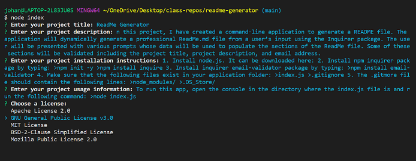
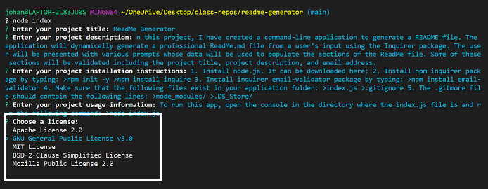
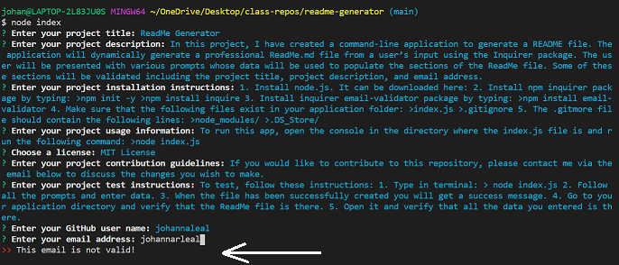
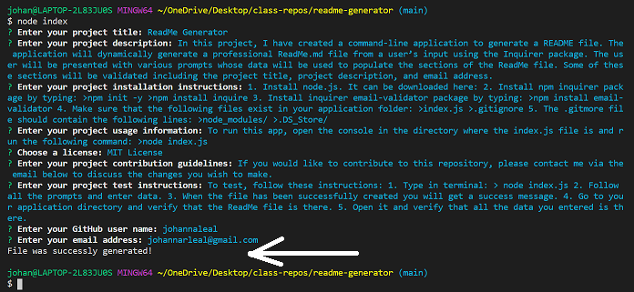

# Professional README Generator

## Description

In this project, I have created a command-line application to generate a README file. The application will dynamically generate a professional ReadMe.md file from a user’s input using the Inquirer package. The user will be presented with various prompts whose data will be used to populate the sections of the ReadMe file. Some of these sections will be validated including the project title, project description, and email address.

## Table of Contents

* [Installation](#installation)
* [Usage](#usage)
* [License](#license)
* [Contributing](#contributing)
* [Tests](#tests)
* [Questions](#questions)

## Installation

1. Install node.js. It can be downloaded here: [node.js Downloads](https://nodejs.org/en/download/)
2. Install npm inquirer package by typing:
    >npm init -y
    >npm install inquirer
3. Install inquirer email-validator package by typing:
    >npm install email-validator
4. Make sure that the following files exist in your application folder:
    >index.js
    >.gitignore
5. The .gitmore file should contain the following lines:
    >node_modules/
    >.DS_Store/

## Usage

To run this app, open the console in the directory where the index.js file is and run the following command:
>node index.js

You will receive prompts for the following:

1. Project Title - required
2. Project Description - required
3. Installation Instructions - optional
4. Usage Information - optional
5. License - required; choose from a list
6. Contribution Guidelines - optional
7. Test Instructions - optional
8. GitHub Username - optional
9. Email Address - required and validated for correct format

_Note that for Installation Instructions and Test Instructions, you will be prompted to enter your information in your local editor. If there are several steps involved in either of these sections, it is best to use numbered lists._

## Screenshots

### Enter Project Title, Project Description, Installation Instructions, and License

### License List Prompt

### Invalid Email Message

### File Was Successfully Create

## License

This application is covered under license: MIT License.

## Contributing

If you would like to contribute to this repository, please contact me via the email below to discuss the changes you wish to make.

## Tests

To test, follow these instructions:

1. Type in terminal:
    > node index.js
2. Follow all the prompts and enter data.
3. When the file has been successfully created you will get a success message.
4. Go to your application directory and verify that the ReadMe file is there.
5. Open it and verify that all the data you entered is there.

_NOTE: FOR TESTING PURPOSES I NAMED THE OUTPUT FILE README_TEST.MD SO AS NOT TO OVERWRITE MY ACTUAL README FILE. YOU CAN CHANGE THIS IN THE writeUserInfo CONST._

## Questions

### Contact Information

GitHub Profile: [@johannaleal](http://github.com/johannaleal)

Email: <johannarleal@gmail.com>
